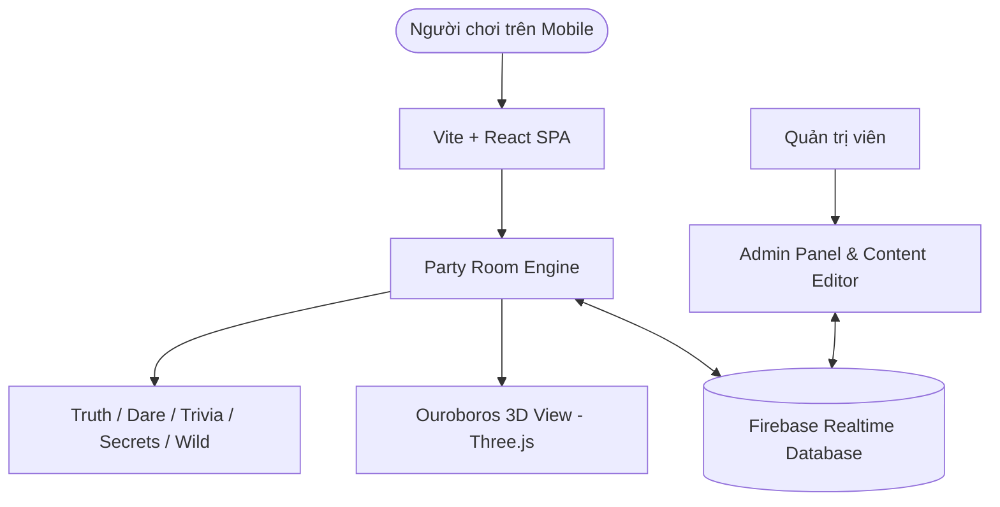

# Velvet Vines 🍷✨

> **Interactive social card party game web application designed for mobile devices.**  
> Real-time multiplayer rooms, intimate challenges, and interactive 3D aesthetics.

---

## 🌟 Tính năng nổi bật (Key Features)

- **Đa dạng chế độ chơi (Game Modes)**:
  - **Truth or Dare**: Các thử thách từ nhẹ nhàng đến táo bạo.
  - **Drunk Trivia**: Câu hỏi đố vui nhộn tăng tính gắn kết cho bữa tiệc.
  - **Deep Secrets**: Những câu hỏi sâu sắc để thấu hiểu bạn bè.
  - **Wild Cards**: Những lá bài đột biến tạo bất ngờ.
  - **Sacred Contract**: Thỏa thuận bảo mật cuộc vui trước khi bắt đầu.
- **Trải nghiệm 3D sống động**: Tích hợp Ouroboros 3D tương tác bằng Three.js.
- **Đồng bộ thời gian thực (Real-time Multiplayer)**: Phòng chơi nhiều người đồng bộ tức thì thông qua Firebase Realtime Database.
- **Mobile-first UI**: Tối ưu hóa mượt mà cho trải nghiệm vuốt chạm trên điện thoại di động.

---

## 🏗️ Kiến trúc ứng dụng (Architecture)



---

## 🚀 Bắt đầu nhanh (Quick Start)

### 1. Yêu cầu môi trường (Prerequisites)
- **Node.js**: Phiên bản 18.0.0 trở lên
- **npm** hoặc **yarn** / **pnpm**

### 2. Cài đặt
```bash
# Clone repository
git clone https://github.com/hungvdn1314/velvet-vines.git
cd velvet-vines

# Cài đặt thư viện phụ thuộc
npm install
```

### 3. Cấu hình biến môi trường
Tạo file `.env.local` (nếu có cấu hình Firebase riêng):
```env
VITE_FIREBASE_API_KEY=your_api_key_here
VITE_FIREBASE_AUTH_DOMAIN=your_auth_domain
VITE_FIREBASE_DATABASE_URL=your_database_url
VITE_FIREBASE_PROJECT_ID=your_project_id
```

### 4. Khởi chạy môi trường phát triển (Development)
```bash
npm run dev
```
Mở trình duyệt tại: `http://localhost:5173` (hoặc cổng hiển thị trên terminal).

---

## 📁 Cấu trúc dự án (Project Structure)

```text
velvet-vines/
├── src/
│   ├── assets/             # Hình ảnh, logo, tài nguyên tĩnh
│   ├── components/         # Các thành phần giao diện & chế độ chơi
│   │   ├── Lobby.jsx       # Sảnh chờ và tạo phòng
│   │   ├── PartyRoom.jsx   # Phòng tiệc chính
│   │   ├── Ouroboros3D.jsx # Hiệu ứng 3D Three.js
│   │   ├── TruthOrDare.jsx # Chế độ Sự thật hay Thử thách
│   │   ├── DrunkTrivia.jsx # Chế độ Đố vui
│   │   └── AdminPanel.jsx  # Bảng quản trị & biên tập nội dung
│   ├── data/               # Dữ liệu thẻ bài & câu hỏi mặc định
│   ├── firebase.js         # Kết nối Firebase Realtime Database
│   ├── App.jsx             # Root Component
│   └── main.jsx            # Entry point
├── index.html              # HTML shell
├── package.json            # Scripts & dependencies
└── vite.config.js          # Cấu hình Vite bundler
```

---

## 📜 Giấy phép (License)

&copy; 2026 Vũ Đình Nghĩa Hưng (IrrationaL). All rights reserved.
